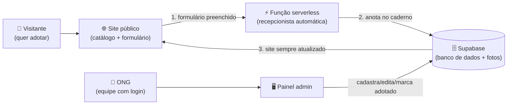

# 🐾 Adota Patos — Documentação do Projeto

> **Documento vivo.** Tudo que a gente inserir, mudar ou melhorar deve ser registrado aqui.
> Regra de ouro: **fez algo novo no projeto? Atualize este documento** (seção 11 — Registro de Desenvolvimento).

---

## 1. Identificação do Projeto

| Campo | Informação |
|---|---|
| **Título** | Adota Patos — Plataforma Web de Adoção de Animais |
| **Área temática** | Tecnologia (com impacto social em bem-estar animal e comunidade) |
| **Modalidade de extensão** | Prestação de Serviço / Voluntariado tecnológico |
| **Equipe** | John Lennon Salviano Soares (back-end: banco, integrações, automações) • Matheus de Lima Eliziário (front-end: site público e painel da ONG) |
| **Instituição** | UNINASSAU — Centro Universitário • Curso: Análise e Desenvolvimento de Sistemas (ADS) |
| **Disciplina** | Atividades Práticas Interdisciplinares de Extensão I |
| **Período de execução** | Início de agosto/2026 – em andamento |

---

## 2. Introdução e Justificativa

Toda semana, em Patos-PB, animais são abandonados ou vivem nas ruas dependendo da boa vontade de protetores independentes. A ONG **Adota Patos** trabalha resgatando esses animais, cuidando deles e buscando pessoas dispostas a adotar.

O problema que a ONG enfrenta é quase todo manual: os animais disponíveis são divulgados em stories e grupos de WhatsApp, as solicitações de adoção chegam espalhadas por comentários e mensagens privadas, e ninguém consegue responder rápido quem demonstrou interesse. O resultado é conhecido: **animal demora a ser adotado, adotante desiste no meio do caminho e a ONG afoga em mensagens.**

Este projeto resolve isso com tecnologia simples e gratuita:

- Um **site público**, onde qualquer pessoa vê os animais disponíveis e se candidata a adotar em um formulário;
- Um **painel administrativo**, onde a ONG cadastra animais, publica fotos, marca adoções concretizadas e acompanha todas as solicitações num lugar só;
- Uma esteira automática nos bastidores: quando alguém preenche o formulário, os dados **chegam sozinhos** no banco de dados da ONG, sem ninguém precisar copiar e colar nada.

O impacto social está no elo mais fraco que a tecnologia fortalece: **quanto mais rápido um animal aparece para o adotante certo, mais curta é a espera dele por um lar.** E quanto menos tempo a ONG gasta com trabalho administrativo repetitivo, mais tempo ela dedica aos animais.

O benefício alcança toda a cidade, não só os animais e adotantes: **cada adoção responsável é um animal a menos nas ruas**, o que significa menos risco de atropelamentos em vias movimentadas, menos possibilidade de ataques a pedestres — especialmente crianças e idosos — e menos circulação de doenças transmitidas por animais sem cuidados. A plataforma, portanto, contribui indiretamente para a **segurança e a saúde pública de Patos**, enquanto promove a convivência mais humana entre pessoas e animais.

> Em uma frase: **usamos o que aprendemos no curso para transformar o fluxo de adoção de uma ONG real, de graça, de forma que eles consigam manter sozinhos depois.**

---

## 3. Objetivos

### Objetivo geral
Construir e entregar uma plataforma web completa (site + painel) que digitalize todo o processo de adoção da ONG Adota Patos, permitindo que a equipe publique animais e gerencie solicitações **sem depender de programador** para o dia a dia.

### Objetivos específicos
1. Exibir publicamente os animais disponíveis, com foto, nome, idade, sexo, porte e descrição;
2. Receber solicitações de adoção por formulário web, salvando tudo automaticamente no banco de dados;
3. Dar à ONG um painel protegido por login para cadastrar, editar, excluir e marcar animais como "Adotado";
4. Centralizar as solicitações de adoção para a ONG visualizar e avaliar;
5. Usar apenas ferramentas com plano gratuito (Supabase e seus recursos incluídos), tornando o projeto **sustentável sem custo fixo**;
6. Documentar tudo em linguagem acessível, para que qualquer pessoa da ONG (ou outro aluno) consiga entender e dar manutenção.

---

## 4. Caracterização da Área / Localidade

O projeto atende a ONG **Adota Patos**, sediada em **Patos, sertão da Paraíba**. A região convive com alto índice de abandono de cães e gatos, e o trabalho dos protetores depende de divulgação voluntária. A plataforma tem alcance imediato na cidade e região, mas funciona em qualquer lugar com internet — podendo servir de modelo para outras ONGs.

---

## 5. Locais de Execução, Público-Alvo e Parcerias

| Item | Detalhe |
|---|---|
| **Local de execução** | Remoto (desenvolvimento) + ONG Adota Patos (implantação e treinamento) |
| **Público-alvo direto** | Equipe da ONG Adota Patos |
| **Público-alvo indireto** | Pessoas que querem adotar; animais resgatados; comunidade de Patos-PB |
| **Parcerias** | ONG Adota Patos (fornecimento de conteúdo, fotos reais e validação do processo) |

---

## 6. Materiais e Métodos

### 6.1 Ferramentas utilizadas (todas com plano gratuito)

| Ferramenta | Papel no projeto | Por quê essa |
|---|---|---|
| **HTML/CSS/JavaScript** | Site público e painel da ONG | Roda em qualquer navegador, sem instalação |
| **Supabase** | Banco de dados + armazenamento das fotos | Gratuito, tem interface amigável, expõe API pronta |
| **Edge Function (Supabase)** | Recepcionista automático do formulário | Roda nos servidores do Supabase 24/7, incluída no plano gratuito — avaliamos o n8n Cloud, mas ele vira pago após o período de teste |
| **GitHub** | Guardar o código e histórico | Trabalho em dupla com versionamento |
| **Mermaid** | Diagramas desta documentação | Os diagramas são texto — fáceis de atualizar |

### 6.2 Como dividimos o trabalho

- **Matheus (front-end):** telas do site, telas do painel, experiência do usuário;
- **John (back-end):** modelagem do banco, segurança de acesso, endpoint serverless do formulário, integrações e esta documentação.

### 6.3 Método de trabalho

Trabalhamos em etapas curtas: primeiro o banco funcionando, depois o receptor do formulário, depois o site conectado. Cada etapa termina **testada e registrada** neste documento (seção 11). Toda tarefa vira uma Issue no GitHub e entra via Pull Request — assim fica rastro de quem fez o quê e por quê.

---

## 7. Arquitetura do Sistema — para que serve cada coisa

Aqui está o coração do projeto explicado sem mistério. São **três peças** trabalhando juntas:

### As três peças, uma por uma

**1. Supabase — o "caderno oficial" da ONG.**
É onde moram TODAS as informações: os animais cadastrados, as fotos, as solicitações de adoção. O site lê daqui; o painel escreve aqui. Quando a ONG marca o Thor como "Adotado" no painel, é esse registro que muda — e o site para de mostrar o Thor na hora, porque ele sempre consulta o mesmo caderno.

**2. Site público — a vitrine.**
Qualquer pessoa acessa, vê os animais disponíveis, clica em "Quero adotar" e preenche o formulário. Ele não salva nada diretamente no banco: entrega o formulário para a recepcionista abaixo.

**3. Função serverless (`receber-adocao`) — a recepcionista automática.**
Quando o formulário chega, ela confere os campos com atenção (e avisa, com educação, o que está faltando), depois anota no "caderno" (Supabase), no capítulo certo (tabela `adocoes`). Por que não deixar o site gravar direto? **Segurança:** o site é público — se ele tivesse a chave para gravar no banco, qualquer pessoa mal-intencionada poderia usar essa chave. Com a recepcionista no meio, o banco só aceita escrita de solicitações vindas dela.

> 💡 **Por que não usamos o n8n?** Avaliamos essa ferramenta no planejamento, mas o serviço em nuvem vira pago após o período de teste (~R$150/mês) e hospedar em casa exigiria um computador ligado 24 horas. A função serverless do próprio Supabase faz o mesmo papel, já está incluída no plano gratuito e nunca dorme. Decisão registrada na seção 11.

### O caminho de cada ação

| O que acontece | Caminho |
|---|---|
| ONG cadastra o Thor | Painel → Supabase → Thor já aparece no site |
| ONG marca Thor como Adotado | Painel → Supabase muda o status → some do catálogo |
| Visitante se candidata | Site → função `receber-adocao` → tabela `adocoes` → ONG vê no painel |
| Visitante vê animal | Site lê tabela `animais` (só os Disponíveis) |

---

## 8. Modelagem de Dados (resumo)

O detalhamento completo — entidades, atributos, relacionamentos, cardinalidades e dicionário de dados — está no documento dedicado:

📄 **[MODELO_CONCEITUAL.md](./MODELO_CONCEITUAL.md)**

Em resumo, guardamos duas "fichas":

- **`animais`** — a ficha de cada animal (nome, idade, sexo, porte, foto, descrição e status: *Disponível* ou *Adotado*);
- **`adocoes`** — a ficha de cada candidato a adotante (dados de contato, experiência com animais, motivo) ligada ao animal pretendido.

Um animal pode receber **várias** solicitações; cada solicitação aponta para **um** animal (ou fica órfã se o animal for removido).

---

## 9. Resultados Esperados

1. Catálogo online sempre atualizado, eliminando a divulgação fragmentada em redes sociais;
2. Redução do esforço administrativo da ONG (sem copiar/colar dados de mensagens);
3. Todas as solicitações centralizadas, com data e contato do interessado;
4. ONG autônoma: capaz de gerenciar tudo sozinha após treinamento;
5. Projeto replicável: outra ONG pode clonar a ideia com custo zero.

**Indicadores de sucesso:** número de animais cadastrados pela própria ONG; número de solicitações recebidas pelo site; tempo médio entre solicitação e resposta da ONG.

---

## 10. Cronograma

| Etapa | O que acontece | Status |
|---|---|---|
| 1. Planejamento e pesquisa | Definição do escopo, referências e ferramentas | ✅ Concluída |
| 2. Protótipo do site | Matheus monta o layout do site público | ✅ Concluída |
| 3. Banco de dados | Criação do projeto Supabase, tabelas e storage | ✅ Concluída |
| 4. Receptor do formulário | Endpoint serverless (`receber-adocao` → Supabase) | ✅ Concluída |
| 5. Integração do site | Formulário enviando ao webhook; catálogo lendo o banco | ⏳ Pendente |
| 6. Painel da ONG | Login, CRUD de animais, lista de solicitações | ⏳ Pendente |
| 7. Testes completos | Fluxo inteiro ponta a ponta | ⏳ Pendente |
| 8. Implantação e treinamento | Colocar no ar e treinar a equipe da ONG | ⏳ Pendente |
| 9. Relatório final | Fechamento da documentação para entrega | ⏳ Pendente |

---

## 11. Registro de Desenvolvimento 📝

> **Regra do projeto: cada coisa que entrarmos ou melhorarmos ganha uma linha aqui.** É o nosso diário de bordo — serve para o relatório final da extensão e para lembrar decisões.

| Data | O que foi feito | Responsável |
|---|---|---|
| 2026-08-01 a 08-18 | **Fase de estudo e pesquisa (antes de qualquer código)**: levantamento de plataformas similares de adoção, comparação entre ferramentas (Supabase, Firebase, n8n), estudo de Row Level Security, LGPD aplicada a pequenos sites e boas práticas de segurança em projetos web. Essa base teórica orientou todas as decisões seguintes | John e Matheus |
| 2026-08-19 | Matheus entregou o protótipo HTML do site público (layout completo: catálogo, modal, formulário, responsivo) | Matheus |
| 2026-08-19 | Divisão formal do trabalho: John = back-end/banco/integrações; Matheus = front-end/painel da ONG | John e Matheus |
| 2026-08-22 | Criada esta documentação viva + modelo conceitual dos dados | John |
| 2026-08-22 | Projeto criado no Supabase (conta conectada) | John |
| 2026-08-22 | Script SQL do banco criado (`backend/supabase/schema.sql`) — pendente de execução | John |
| 2026-08-22 | Criado repositório público [johnsalviano/adota-patos](https://github.com/johnsalviano/adota-patos) e o contrato `AGENTS.md` (3 camadas de padrão: Issues/PRs, motion principles, observabilidade+qualidade+testes) | John |
| 2026-08-22 | Criadas as Issues #1–#9 cobrindo o cronograma: banco Supabase, webhook n8n, integração do site, painel da ONG, ferramentas de qualidade, testes E2E, Sentry e deploy | John |
| 2026-08-22 | **Banco no ar** (#1 concluída): `schema.sql` executado — tabelas `animais`/`adocoes`, bucket `fotos-animais`, políticas RLS ativas | John |
| 2026-08-22 | Testes de segurança aprovados via API pública: visitante lê catálogo (200), escrita anônima bloqueada em ambas as tabelas (401) | John |
| 2026-08-22 | **Migração 002** (`backend/supabase/002_acessos_ong.sql`): criada lista `perfis_membros` — só e-mails autorizados pela ONG têm poderes administrativos, mesmo entre contas logadas. Defesa contra criação de contas falsas. Passo a passo de como dar/remover acesso documentado no MODELO_CONCEITUAL.md §5 | John |
| 2026-08-22 | **Decisão de arquitetura**: substituímos o n8n por uma Edge Function do próprio Supabase (`receber-adocao`). Motivo: n8n Cloud não tem plano gratuito permanente (~R$150/mês após o trial) e a ONG exige custo zero. A função roda 24/7 nos servidores do Supabase sem máquina dedicada. Critério registrado: custo zero > ferramenta específica | John |
| 2026-08-22 | **Formulário no ar** (#2 concluída): endpoint público testado de ponta a ponta — valida campos com mensagens amigáveis, grava em `adocoes` com status `Pendente`, responde ao site em JSON humanizado. Testes: payload válido (200 + linha gravada), campos faltando (400 com lista do que falta), payload malformado (400). Linha de teste removida após verificação | John |
| 2026-08-22 | Gerada a **imagem do modelo conceitual** na notação clássica de Peter Chen (`docs/diagramas/modelo-conceitual.png`, fonte editável `.dot` no mesmo diretório) para o relatório/apresentação da faculdade | John |

| 2026-08-23 | **Protótipo integrado ao back-end real**: criado `gerar_frontend.py`, script que lê o HTML do Matheus e injeta as chamadas reais (catálogo via API, modal dinâmico, formulário → Edge Function). Motivo: permite evoluir o site sem apagar o trabalho do colega - o protótipo continua sendo a fonte visual | John |
| 2026-08-23 | **Correção importante de integração**: o catálogo dava erro 400 porque o código buscava coluna inexistente (`criado_em`); a coluna real do banco é `created_at`. Lição registrada: sempre conferir o schema antes de consumir a API | John |
| 2026-08-23 | **Vulnerabilidade XSS corrigida**: o protótipo renderizava dados do banco com `innerHTML` sem tratamento - um animal cadastrado com `<script>` no nome executaria código no navegador de todo visitante. Solução: função de escape aplicada a TODO dado antes de renderizar + URLs de foto aceitas somente `https://`. Prova: inserimos animal malicioso de teste, confirmamos que aparece como texto inerte e limpamos o banco | John |
| 2026-08-23 | **Pacote LGPD implementado** (Issues #13 e #18): migração 003 adicionou `consentimento_lgpd` e `termo_versao` em `adocoes`; o formulário ganhou caixa de autorização obrigatória (não envia sem marcar) com resumo legível do uso dos dados; a Edge Function recusa envio sem consentimento (400) e grava a versão do termo aceita | John |
| 2026-08-23 | **Banner de cookies** (#15): aviso na primeira visita com Aceitar/Recusar; escolha fica salva no navegador; Google Analytics só carrega após aceite - conformidade LGPD desde o primeiro clique | John |
| 2026-08-23 | **Proteção contra robôs e abuso** (#16): migração 004 criou tabela de controle + função atômica `registrar_envio`; limite de 5 envios/minuto por IP e teto global de 60/min; campo-armadilha (honeypot) invisível para humanos - bot que preenche recebe resposta falsa de sucesso e não polui o banco | John |
| 2026-08-23 | **Por que o limite tem também um teto global**: descobrimos nos testes que o cabeçalho de IP pode ser forjado (chega como lista de IPs internos), diluindo o limite por IP. O teto global garante proteção mesmo contra esse truque, sem afetar uso legítimo | John |
| 2026-08-23 | **Log de segurança** (#19, migração 005): tabela `log_seguranca` registra eventos suspeitos (honeypot acionado, rate limit estourado) apenas com evento, IP e detalhe técnico - nenhum dado pessoal; limpeza automática aos 90 dias via agendador do banco | John |
| 2026-08-23 | **Retenção automática de dados** (#14): job diário à meia-noite remove solicitações de adoção com mais de 6 meses - a LGPD exige guardar dados pessoais só pelo tempo necessário à finalidade | John |
| 2026-08-23 | **CORS restrito**: a Edge Function só responde às origens conhecidas (localhost hoje, domínio futuro depois); site desconhecido não consegue disparar nosso endpoint escondido | John |
| 2026-08-23 | **Teste de invasão (pentest) com 12 vetores**: SQL injection (bloqueado pela WAF Cloudflare do Supabase, 403), leitura de dados pessoais por anônimo (bloqueado pela RLS), envio sem consentimento (400), honeypot (resposta falsa), rajada de envios (429), JSON malformado, origem desconhecida etc. Encontradas e corrigidas 2 falhas reais: XSS persistente (registro acima) e rate limit contornável por IP forjado (resolvido com teto global) | John |
| 2026-08-23 | **Endurecimento da função** (auditoria F1-F4): IP pega o último da cadeia XFF (mais confiável), limite de tamanho do payload (413 acima de 10 KB), regex de e-mail reforçada, limites server-side espelhando os do navegador - defesa em camadas | John |
| 2026-08-23 | **Limites de digitação com padrão brasileiro**: nome 80 (padrão Polícia Federal/passaporte gov.br), telefone 15 (formato ANATEL "(83) 99999-9999"), cidade 40, motivo 300 com contador visível (referência PRODABEL-BH). Aplicados no navegador E no servidor | John |
| 2026-08-23 | **SEO básico** (das 9 dicas pós-lançamento, as que já dependiam só de nós): `robots.txt`, título com palavra-chave local ("Adote cães e gatos para adoção em Patos-PB"), meta description, Open Graph para compartilhamento bonito e favicon 🐾 (eliminou o único erro 404 do console). Search Console, Meu Negócio, sitemap final e domínio próprio ficam para quando o site estiver publicado - dependem de URL pública | John |
| 2026-08-23 | **Bateria técnica final 16/16**: carregamento ~670ms, responsividade provada por geometria em 3 larguras (3/2/1 colunas), imagens carregadas, maxlength reais, contador, modal abre/fecha por X e clique fora, consentimento persistente, console e rede limpos | John |
| 2026-08-23 | **Auditoria final de segurança e banco**: RLS ativa nas 5 tabelas, anônimo lê lista vazia em dados sensíveis e recebe 401 em escrita, storage público restrito às fotos do catálogo, índices adequados, FK com ON DELETE SET NULL, CHECKs de domínio (status/porte/sexo), e-mail único em membros. Comparação com o caso Moltbook/Wiz (fev/2026) confirma nossa arquitetura | John |

| 2026-08-23 | **História real da ONG no site** (#31): seção "Sobre nós" reescrita com dados verdadeiros (fundação em 11/06/2018, resgate/tratamento/castração/adoção, apoio a tutores de baixa renda, sustentação por doações e voluntariado) e canais oficiais no "Contato" (@adotapatosoficial no Instagram/Facebook, WhatsApp, e-mail da ONG) - fim dos links placeholder | John |

*(próximos registros entram aqui)*

---

## 12. Segurança e LGPD — por que cada decisão foi tomada

> Esta seção existe porque na apresentação não basta mostrar **o que** fizemos:
> precisamos defender **por quê**. Cada decisão abaixo nasceu de um risco real,
> muitos deles ilustrados por casos que apareceram nos noticiários em 2025-2026.

### 12.1 A lição do iFood (dez/2025): validar quem acessa o quê

Em dezembro/2025 o iFood sofreu acesso indevido aos dados cadastrais de
~1,2 milhão de usuários através de uma falha do tipo **IDOR** (acesso direto a
objetos sem verificar permissão) e demorou 6 meses para comunicar a ANPD.
**O que aprendemos e aplicamos:** nenhuma consulta ao banco confia no cliente.
Quem pode ler solicitações de adoção é definido por política no banco (RLS),
não pela tela. E registramos base de consentimento (`termo_versao`) para saber
exatamente o que cada titular autorizou e quando.

### 12.2 A lição do Moltbook (fev/2026): chave pública + RLS

Uma rede social expôs 1,5 milhão de tokens e milhares de e-mails porque usava
Supabase **sem políticas de Row Level Security**: a chave pública que fica no
navegador virou passe livre para o banco inteiro, inclusive escrita.
**Nossa arquitetura é exatamente esse cenário — com a diferença que salva:**
a chave publicável está no nosso HTML (por design do Supabase), mas TODAS as
5 tabelas têm RLS ativa. Provamos com testes: anônimo lê catálogo de animais
disponíveis (conteúdo público do site), mas recebe lista vazia em `adocoes`,
`perfis_membros`, `log_seguranca` e `rate_limit_envios`, e leva 401 ao tentar
escrever em qualquer tabela.

### 12.3 Defesa em camadas (se uma falhar, a próxima segura)

| Camada | Protege contra | Como provamos |
|---|---|---|
| WAF Cloudflare (do Supabase) | SQL injection, path traversal | Payload malicioso → 403 antes de chegar à função |
| Edge Function | Dados inválidos, excesso de tamanho, sem consentimento | 400 amigável / 413 / bloqueio sem checkbox |
| Rate limit (RPC atômica) | Rajadas de bot | 429 após 5/min por IP; teto global 60/min |
| Honeypot | Robôs preenchedores | Bot ganha resposta falsa 200; banco não grava |
| RLS | Leitura/escrita direta no banco | GET anon → `[]`; POST anon → 401 |
| Escape de HTML (XSS) | Código injetado via cadastro | `<script>` num nome renderiza como texto |
| CORS restrito | Uso do endpoint por outros sites | Origem desconhecida não recebe autorização |

### 12.4 LGPD na prática (não só no papel)

- **Consentimento explícito**: checkbox separado e obrigatório, com resumo
  legível; sem ele nem o servidor aceita (não é só escondido na tela).
- **Prova do consentimento**: gravamos a versão do termo aceita
  (`termo_versao = v1-2026-08`).
- **Minimização**: coletamos só o necessário para contato sobre a adoção;
  logs de segurança guardam apenas evento/IP/detalhe técnico.
- **Retenção**: job diário apaga solicitações com mais de 6 meses
  (art. 15/16 - dados mantidos apenas pelo período necessário).
- **Cookies/analytics**: banner com Aceitar/Recusar; GA só carrega com aceite;
  recusa também é memorizada.
- **Pendências honestas** (pós-MVP): página completa de Política de
  Privacidade; avaliação formal de incidente (o caso iFood mostra o custo de
  não ter processo claro de comunicação à ANPD).

### 12.5 Banco de dados — escolhas de modelagem

- **UUID como chave primária**: IDs não sequenciais não expõem volume de
  registros nem permitem "chutar" o próximo ID.
- **CHECK de domínio** em status/porte/sexo: o banco recusa valor inválido
  mesmo se alguém furar a aplicação.
- **FK com ON DELETE SET NULL**: excluir um animal não apaga o histórico de
  solicitações da ONG (interesse administrativo).
- **Índices** em `animal_id` e `(status, created_at)`: consultas do painel
  ficam rápidas conforme os dados crescem.

### 12.6 O que recomendamos antes de ir ao ar (roadmap curto)

1. Domínio próprio (registro.br, ~R$40/ano) e HTTPS gerenciado;
2. Página de Política de Privacidade completa;
3. Ativar MFA na conta Supabase e rotacionar a senha do banco pós-apresentação;
4. Branch protection + CI básico (padrão dos projetos maduros: cal.com, dub);
5. Google Search Console + sitemap.xml com a URL final;
6. Sentry para erros em produção (plano gratuito).

---

## 13. Referências Bibliográficas

- BRASIL. Ministério da Educação. **Resolução nº 7, de 18 de dezembro de 2018.** Estabelece as Diretrizes para a Extensão na Educação Superior Brasileira. Brasília, 2018.
- MOREIRA, Heloisa de Souza Pimentel. **Atividades Práticas Interdisciplinares de Extensão I.** Recife: Editora Ser Educacional, 2023.
- FREIRE, Paulo. **Extensão ou Comunicação?** Rio de Janeiro: Paz e Terra, 1983.
- DE PAULA, João Antônio. **Extensão universitária: história, conceito e propostas.** Interface — Comunicação, Saúde, Educação, 2013.
- **Supabase Documentation.** Disponível em: https://supabase.com/docs. Acesso em ago. 2026.
- **n8n Documentation.** Disponível em: https://docs.n8n.io. Acesso em ago. 2026.
- **Supabase — Edge Functions.** Disponível em: https://supabase.com/docs/guides/functions. Acesso em ago. 2026.
- ROCHA, Maria Auxiliadora da. *A terceira missão universitária*. 2001 (citado em Moreira, 2023).
