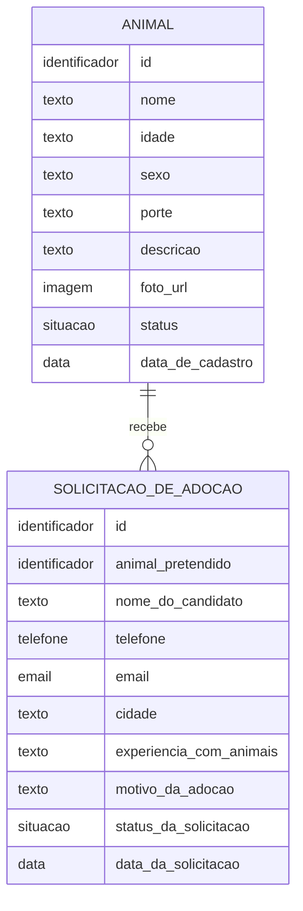
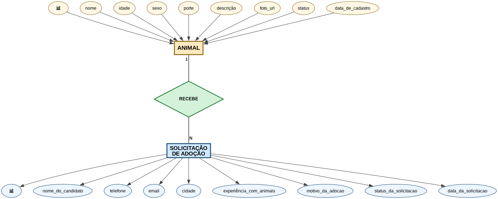

# 🗃️ Adota Patos — Modelo Conceitual de Dados

> Este documento explica **como as informações do sistema se organizam** — em três níveis, como se aprende na faculdade: conceitual (o desenho da ideia), lógico (as tabelas) e físico (o SQL real).

---

## 1. O que este modelo representa

Pense no sistema como **duas fichas de papel** que a ONG já usaria manualmente:

- A **ficha do animal**: quem ele é, como é, e se ainda está disponível;
- A **ficha de candidatura**: quem quis adotar, como falar com essa pessoa e por quê.

Toda vez que alguém se candida a adotar um animal, a ficha de candidatura fica **ligada** à ficha do animal. É esse "ligamento" que o banco de dados formaliza num **relacionamento**.

---

## 2. Modelo Conceitual (MER)

No nível conceitual não existem tipos de dados nem chaves técnicas — só **entidades**, **atributos** e **relacionamentos com cardinalidade**:

### O mesmo desenho na notação clássica (Peter Chen)

*Figura 1 — Modelo conceitual: **retângulos** = entidades · **losango** = relacionamento · **elipses** = atributos (chave primária sublinhada) · cardinalidade **1:N*.*

> Fonte editável em [`diagramas/modelo-conceitual.dot`](./diagramas/modelo-conceitual.dot) — para regenerar a imagem: `dot -Tpng modelo-conceitual.dot -o modelo-conceitual.png`

### Lendo o relacionamento

| Leitura | Cardinalidade |
|---|---|
| Um **animal** pode receber **zero ou muitas** solicitações | `0..N` |
| Uma **solicitação** refere-se a **um único** animal | `1` |
| Notação Mermaid usada: `||--o{` | um-para-zero-ou-muitos |

**Por que "zero"?** Duas situações reais:
1. Um animal recém-cadastrado ainda não recebeu nenhuma candidatura;
2. Se a ONG remover um animal do banco, suas antigas solicitações **não são apagadas junto** — ficam sem vínculo (histórico preservado). Isso é decidido na chave estrangeira com `ON DELETE SET NULL`.

---

## 3. Modelo Lógico (as tabelas)

Aqui as entidades viram tabelas com colunas tipadas e chaves:

### Tabela `animais`

| Coluna | Tipo | Regra | O que guarda |
|---|---|---|---|
| `id` | `UUID` | PK, gerado automático | Número de identificação único do animal |
| `nome` | `TEXT` | obrigatório | Nome do animal (ex.: "Thor") |
| `idade` | `TEXT` | obrigatório | Idade descritiva ("2 anos", "Filhote") |
| `sexo` | `TEXT` | obrigatório, só `Macho`/`Fêmea` | Sexo do animal |
| `porte` | `TEXT` | obrigatório, só `Pequeno`/`Médio`/`Grande` | Porte físico |
| `descricao` | `TEXT` | obrigatório | Temperamento e história do animal |
| `foto_url` | `TEXT` | opcional | Endereço da foto (armazenada no Supabase Storage) |
| `status` | `TEXT` | padrão `Disponível`, só `Disponível`/`Adotado` | Situação da adoção |
| `created_at` | `TIMESTAMPTZ` | preenchido automático | Data/hora do cadastro |

### Tabela `adocoes`

| Coluna | Tipo | Regra | O que guarda |
|---|---|---|---|
| `id` | `UUID` | PK, gerado automático | Identificador único da solicitação |
| `animal_id` | `UUID` | FK → `animais.id`, pode ficar vazio | Animal pretendido pelo candidato |
| `nome` | `TEXT` | obrigatório | Nome completo de quem quer adotar |
| `telefone` | `TEXT` | obrigatório | Telefone/WhatsApp de contato |
| `email` | `TEXT` | obrigatório | E-mail de contato |
| `cidade` | `TEXT` | obrigatório | Cidade do candidato |
| `experiencia` | `TEXT` | obrigatório | Se já teve animais antes |
| `motivo` | `TEXT` | obrigatório | Por que deseja adotar |
| `status` | `TEXT` | padrão `Pendente`, só `Pendente`/`Aprovada`/`Rejeitada` | Andamento avaliado pela ONG |
| `created_at` | `TIMESTAMPTZ` | preenchido automático | Data/hora da candidatura |

### As restrições (`CHECK`) contam uma história

Os campos `sexo`, `porte`, `status` aceitam **apenas valores da lista**. Isso impede erros bobos que quebrariam o site — tipo alguém digitar "MACHO" num lugar, "macho" noutro, "m" no terceiro. Com a lista fixa, os filtros do site sempre funcionam.

---

## 4. Armazenamento das fotos (Supabase Storage)

As fotos não entram dentro das tabelas — isso deixaria o banco pesado. Elas ficam num **bucket** (pasta de arquivos) chamado `fotos-animais`, e a tabela `animais` guarda apenas o **endereço** da foto (`foto_url`). É como guardar as fotos num álbum e escrever no caderno onde cada foto está.

---

## 5. Segurança de acesso (RLS — Row Level Security)

O Supabase permite definir **quem pode ler e quem pode escrever** cada tabela. Nossa política tem **duas fechaduras**:

**Fechadura 1 — tipo de conta:** visitante anônimo vs. pessoa logada.

**Fechadura 2 — lista de membros (`perfis_membros`):** mesmo entre quem está logado, só quem tem o e-mail **na lista autorizada pela ONG** exerce poderes administrativos. A função `eh_membro_ong()` faz essa verificação a cada operação.

| Quem | `animais` | `adocoes` | Fotos |
|---|---|---|---|
| Visitante do site (sem login) | ✅ Lê apenas Disponíveis | ❌ Não acessa direto | ✅ Só vê |
| Conta logada FORA da lista | ❌ Nada | ❌ Nada | ❌ Nada |
| Membro da ONG (logado + na lista) | ✅ Controla tudo | ✅ Lê e avalia | ✅ Envia/edita |
| Função serverless (chave privada) | ❌ | ✅ Grava novas candidaturas | ❌ |

### Como a ONG dá acesso a uma nova pessoa

1. **Authentication → Users → Add user**: cria o login (e-mail + senha) da pessoa;
2. **Table Editor → perfis_membros**: insere o mesmo e-mail na lista;
3. Pronto: a pessoa entra pelo painel com poderes de administração.

Remover acesso = tirar o e-mail da lista (a conta deixa de ter poderes imediatamente).

---

## 6. Do modelo ao SQL

O script físico que cria tudo acima (tabelas + restrições + políticas RLS + bucket) está em:

📄 **[backend/supabase/schema.sql](../backend/supabase/schema.sql)**

Ele é executado uma única vez no SQL Editor do projeto Supabase.
